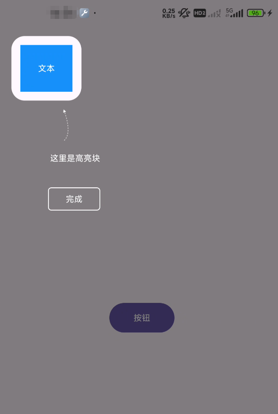
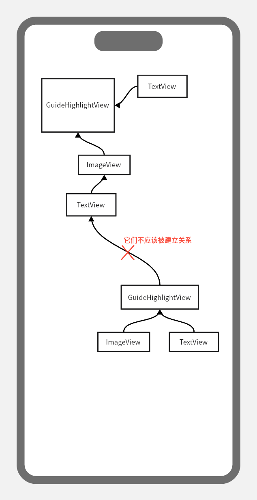

# 高亮引导布局

通过 ConstraintLayout 让高亮引导布局更灵活。

## 使用方法

`GuideConstraintLayout` 继承至 `ConstraintLayout`，并提供了一个 `GuideHighlightView` 作为高亮关系依赖。

以下是基本用法(建议阅读[MainActivity.kt](../app/src/main/java/io/github/guideconstraintlayout/MainActivity.kt)中的代码)：

```xml
    <io.github.thatworld.widget.GuideConstraintLayout
        android:id="@+id/guide_box"
        android:layout_width="match_parent"
        android:layout_height="match_parent"
        app:highlight_background_color="#80000000">

        <io.github.thatworld.widget.GuideHighlightView
            android:id="@+id/highlight_view"
            android:layout_width="48dp"
            android:layout_height="48dp"
            android:layout_marginStart="66dp"
            android:layout_marginTop="66dp"
            app:highlight_padding="12dp"
            app:highlight_radius="18dp"
            app:layout_constraintStart_toStartOf="parent"
            app:layout_constraintTop_toTopOf="parent" />

        <ImageView
            android:id="@+id/guide_icon"
            android:layout_width="42dp"
            android:layout_height="42dp"
            android:layout_marginStart="28dp"
            android:layout_marginTop="12dp"
            android:rotation="180"
            android:src="@drawable/ic_guide"
            app:layout_constraintEnd_toEndOf="@+id/highlight_view"
            app:layout_constraintStart_toStartOf="@id/highlight_view"
            app:layout_constraintTop_toBottomOf="@+id/highlight_view" />

        <TextView
            android:id="@+id/guide_text"
            android:layout_width="wrap_content"
            android:layout_height="wrap_content"
            android:layout_marginTop="16dp"
            android:text="这里是高亮块"
            android:textColor="@color/white"
            app:layout_constraintStart_toStartOf="@id/guide_icon"
            app:layout_constraintTop_toBottomOf="@id/guide_icon" />

        <TextView
            android:id="@+id/guide_finish_button"
            android:layout_width="wrap_content"
            android:layout_height="wrap_content"
            android:layout_marginStart="24dp"
            android:layout_marginTop="32dp"
            android:background="@drawable/text_button_background"
            android:text="完成"
            android:textColor="@color/white"
            app:layout_constraintEnd_toEndOf="@id/guide_text"
            app:layout_constraintTop_toBottomOf="@id/guide_text" />

    </io.github.thatworld.widget.GuideConstraintLayout>
```

接下来只需要在布局中建立绑定关系，就能完成一个高亮布局，与它有依赖关系的布局如`guide_icon`、`guide_text`、`guide_finish_button` 会自动更新它们的连接关系。

```kotlin
    override fun onCreate(savedInstanceState: Bundle?) {
        ...
        binding.text.post {
            componentGuideBinding.guideBox.bindTarget(binding.text, componentGuideBinding.highlightView)
        }
        ...
    }
```

运行图如下：



## 布局关系建议

如果在某个引导布局中需要使用到多个`GuideHighlightView`来标记不同的高亮区域，那么每一个 `GuideHighlightView` 都应该独立存在，它们应该被绑定到目标View上。

尽管在`bindTarget(...)`时会对`GuideHighlightView`的主动依赖关系进行清理，但是在预览阶段，它的主动关系可能干扰到实时显示的效果。

因此不建议`GuideHighlightView`主动对任何其它视图建立关系，示意图大致如下：


